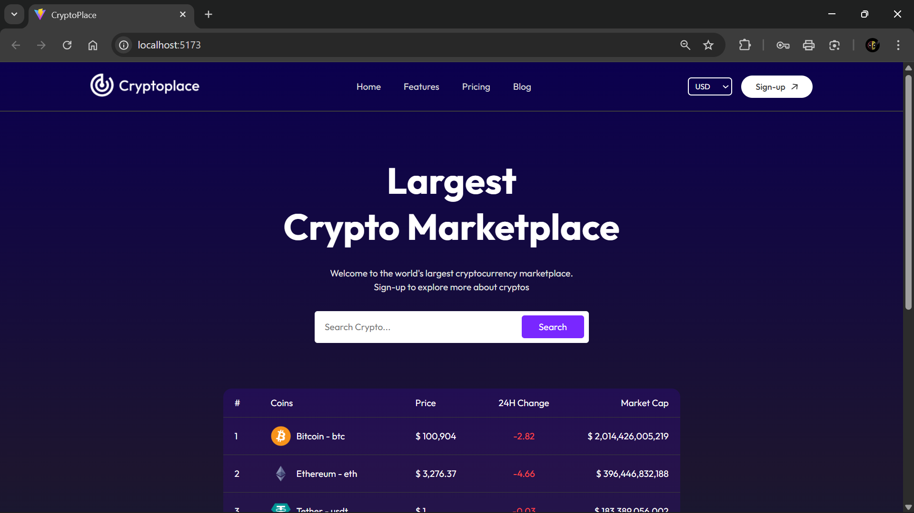
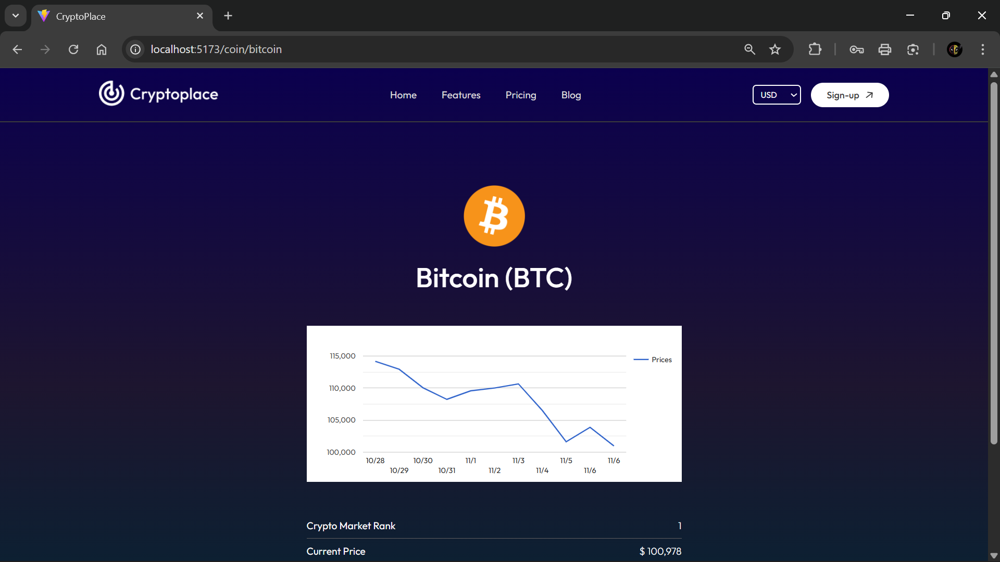
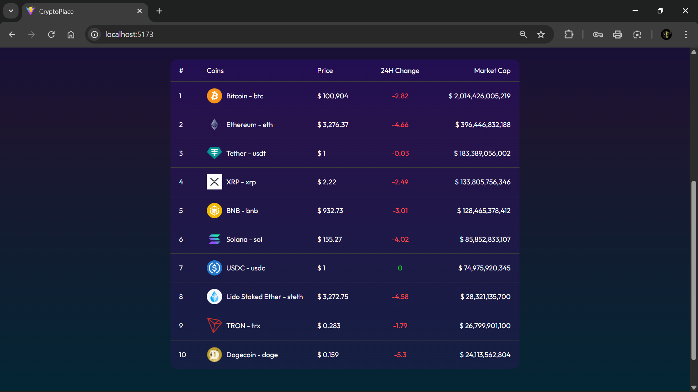
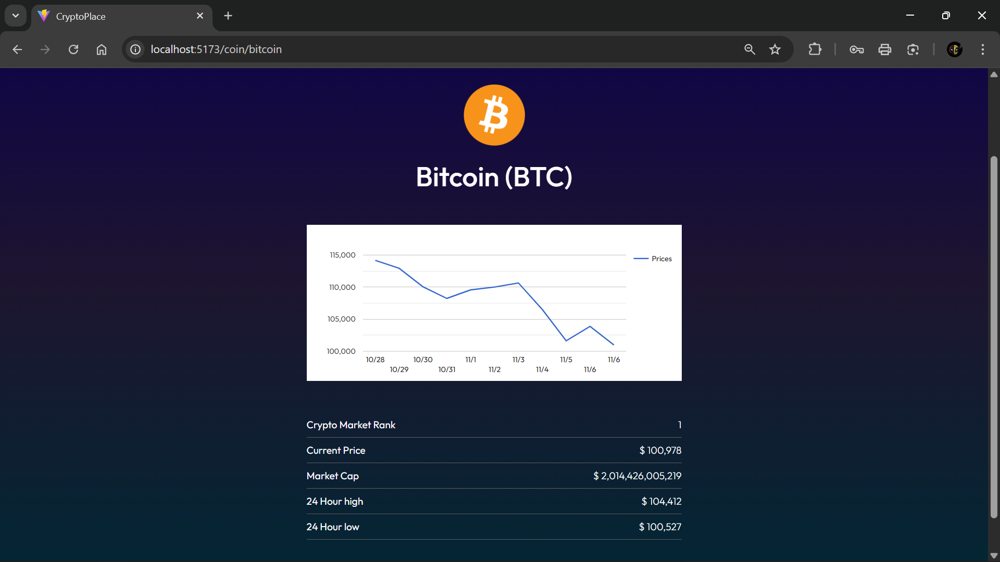

# 💰 CryptoTracker

[](https://ashutosh12505-cryptotracker.vercel.app/)

<p align="left">
  
  
  
  
  
  
</p>

A modern, responsive **cryptocurrency tracking web app** built with **React** and **Vite**, displaying **real-time market data**, **multi-currency conversion**, and **interactive price charts** powered by the **CoinGecko API**.


---

## Project Overview

**CryptoTracker** provides live cryptocurrency data and analytics with a clean, user-friendly UI.  
It lets users track top coins, view price history, and analyze market trends — all within a responsive dark-themed dashboard.

---

## ✨ Key Features

- 📊 **Real-time Market Data** — Displays top 10 cryptocurrencies with live updates  
- 💱 **Multi-Currency Support** — USD, EUR, INR with dynamic conversion  
- 🔍 **Search & Filter** — Find coins instantly by name  
- 💹 **Detailed Coin Pages** — Historical charts, metrics, and market ranks  
- 📈 **Price Visualization** — Interactive 10-day charts using Google Charts  
- 🌓 **Dark Themed Design** — Gradient backgrounds and responsive layouts  
- 📱 **Mobile-Friendly** — Optimized for all screen sizes  

---

## 🛠️ Tech Stack

| Category | Technologies |
|-----------|---------------|
| **Frontend** | React 18.3.1, Vite 5.4.10, React Router DOM 7.3.0 |
| **State Management** | React Context API |
| **Data Visualization** | react-google-charts 5.2.1 |
| **API** | CoinGecko REST API |
| **Styling** | CSS3 (Responsive design) |
| **Code Quality** | ESLint |

---

## 🧩 Project Structure
```
CryptoTracker/
│
├── public/ # Static assets
├── src/
│ ├── assets/ # Images (logo, icons)
│ ├── components/ # Reusable UI components
│ ├── context/ # CoinContext for state management
│ ├── pages/ # Page components (Home, Coin)
│ ├── App.jsx # Routes and layout
│ ├── main.jsx # Entry point
│ └── index.css # Global styles
│
├── screenshots/ # Project screenshots
├── index.html
├── package.json
├── vite.config.js
└── eslint.config.js
```

---

## 🔄 API Integration Flow

- **All Coins Data:** `/coins/markets?vs_currency={currency}`  
- **Coin Details:** `/coins/{coinId}`  
- **Historical Data:** `/coins/{coinId}/market_chart?vs_currency={currency}&days=10`  

Data is fetched via **CoinContext**, stored globally, and rendered dynamically in components and charts.

---

## 🖼️ Screenshots

| Home Page | Coin Details |
|------------|--------------|
|  |  |
|  |  |

---

## 💡 Design Decisions

-  **State Management:** Context API for global state (coins, currency)  
-  **Performance:** Client-side filtering, limited rendering for top coins  
-  **Frontend-only:** CoinGecko provides open API data; no backend required  

---

## 🧭 Possible Improvements

-  Add pagination or infinite scrolling  
-  Cache API results with localStorage  
-  Add loading skeletons & error boundaries  
-  Introduce testing (Jest / React Testing Library)  
-  Migrate to TypeScript  

---

## 🗣️ Quick Summary

> “A responsive React app that tracks real-time crypto prices using CoinGecko API.  
> It supports multiple currencies, features interactive charts, and uses Context API for state management.  
> The project emphasizes clean UI, responsive design, and efficient client-side rendering.”

---

## 👨‍💻 Author

**Ashutosh Kumar Singh**  
- 🌐 [Portfolio](https://ashutosh-12505.vercel.app/)  
- 💼 [LinkedIn](https://www.linkedin.com/in/ashutosh12505/)  
- 💻 [GitHub](https://github.com/ashutosh12505)

---

<p align="center">
  <i>“Code should speak for itself — simplicity is the ultimate sophistication.”</i>
</p>
